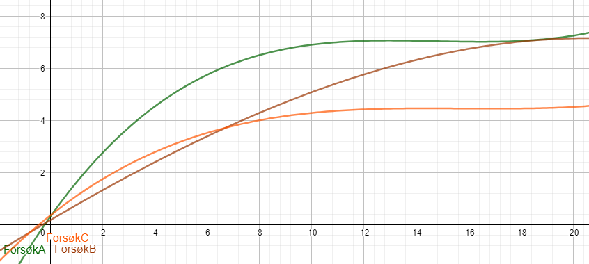

# 1

## a

### Figur 1

$$energi_{aerob} = energi_{glykolyse}+energi_{oxidativphosforilering+chemiosmose} \approx 34ATP \pm 2$$
$$energi_{aerob} = energi_{glykolyse} = 2ATP$$

### Figur 2

Som vi kan se i formelen i figur 1 så er det særdeles lite energi som blir produsert, kun 2ATP (og 2NADH men dette kan ikke brukes). Dette skjer fordi som vi kan se i figur 2 så er det kun glykolysen og fermentering som faktis utføres; alle andre steg av den aerobe celleåndingen unngås i den anaerobe celleåndingen. Dette leder til drastisk mindre energiproduksjon siden mesteparten av energiproduksjonen skjer i elektrontrasporkjeden.

## b

Tolker denne oppgaven som å sammenligne den lauvhengene delen og elektrontrasporkjeden uten chemiosmose fra celleåndingen.

1. De begge har protein gradienter som enten brukes eller skal brukes i ATP-syntase
2. De begge arbeider med proteiner som transporterer elektronene; er elektrontransportkjeder
3. De begge skjer på en membran og ikke inni et organell, thylakoidmembran og indre membran

# 2

## a

PH + Temperatur. Disse er begge faktorer som påvirker enzymal aktivitet. De burde alle bevares på en temperatur nært optimumet, men ikke for høyt ettersom da denatureres proteinene. PH-en burde også reguleres, dette kan enkelt gjøres ved bruk av destillert vann som har en fast PH på 7.

## b

I en situasjon som dette hjelper det å undersøke grafene til funksjonene. Dette gjøres ved polynomial regresjonsanalyse

### Figur 3:

### Figur 4:

Som vi kan se i figur 3 så er stigningshastigheten til A raskest, derfor antar jeg at A ikke fikk en inhibitor tilsatt. Jeg ville også sagt at forsøk C har den ikke konkurrerende inhibitoren ettersom den produserer mye mindre oksygengass etter en stund, dette kan tyde til at substrat fester seg til aktivt sete, men inhibitor fester seg også til det alosteriske setet. Dette etterlater da forsøk B som den eneste som kan ha den konkurrerende inhibitoren.

## c

Siden det tar tid for den kjemiske reaksjonen å ta plass selv, men den reduserte aktiveringsenergien man får av enzymet så kan man nå et tidspunkt der alle enzymene er 'opptatt'. Dette vil da tilsi at reaksjonen ikke kan gå raskere uten å tilsette mer enzym.

# 3

## a

Det er viktig at man må ta målingene et fast sted og tid ettersom hvis det varierte da kan det plutselig oppstå uforutsette feilkilder, disse kan være for eksempel at hvis man tar det på et annet tid av året, for eksempel sommer og vinter så vil man se drastiske endringer i populasjonene ettersom på vinteren så er det mørkere og som da også vanskeligere å utføre fotosyntese. Som følge av dette hvis man målte på sommeren et år følget av å måle på vinteren hadde man sett en kraftig nedgang som man kunne mistolket.

## b

I bildet kan det synes at picoalger og nanoalger divergerer. Det innebærer det blir mer picoalger og mindre nanoalger. Det kan tyde til at hypotese 1 er korrekt, men sammensetningen av alger endrer seg; det blir mer picoalger og mindre nanoalger.

## c

Jeg tolker oppgaven slik: drøft sammenhengen mellom trofisk nivå og opphopning av miljøgifter i det gitte næringsnettet.

Vi kan spalte næringsnettet inn til 2 næringskjeder:

### Figur 5:

$$Nanoalger \Longrightarrow Mikro dyreplankton \Longrightarrow Hoppekreps \Longrightarrow Lodde \Longrightarrow Torsk \Longrightarrow Romgseø \Longrightarrow isbjørn$$
$$Picoalger\Longrightarrow Nanodyreplankton \Longrightarrow Mikro dyreplankton \Longrightarrow Hoppekreps \Longrightarrow Lodde \Longrightarrow Torsk \Longrightarrow Romgseø \Longrightarrow isbjørn$$

Hvis vi antar at energioverføringen fra ledd til ledd er fast på $10\% = 10^{-1}$ selv om den varierer fra art til art. Med dette kan vi forstå at en isbjørn må spise 10 ganger så mye ringsel biomasse som ringseler må spise torsk biomasse som så selv må spise 10 ganger så mye lodde biomasse osv. Da kan vi forstå at en isbjørn må spise ekvivalenten av $10^7$ Pico- og $10^6$ Nanoalger biomasse. Hvis vi så også antar at hver Pico- og Nanoalge har miljøgift tilsvarende $1\frac{miljøgift}{biomasse}$ da vil det si at hvis en isbjørn får i seg næring fra den første næringskjeden vil den få miljøgift tilsvarende $10^6\frac{miljøgift}{biomasse}$ mens den andre gir $10^7\frac{miljøgift}{biomasse}$. En $1000\%$ økning. Derfor når det økes med mer Picoalger øker hyppigheten til den andre næringskjeden og dermed miljøgiftkonsentrasjonen.

# 4

## a

Siden vi observerer at det initialt var veldig mange flere planktonspisende fisk i 2008 så en kraftig redusert mengde i 2011 kan vi godt si at Lakseabbor har regulert populasjonen av planktonspisende fisk. Dette stemmer med resultatet i Paul. Dette forklarer også hvorfor det er så mye laksabbor siden de har spist den plateplantonspisende fisken.

## b

Som vi kan se i diagrammet er det veldig mye mer planktonspisende fisk i peter, gjennom å se på næringskjeden kan dette bety en av 2 ting. 1: det er mye planteplankton som blir spist av dyreplankton — som i sin tur blir spist av planktonspisende fisk. 2: Det er mye planteplankton siden en stor andel av dyreplanktonet har blitt spist av den planktonspisende fisken. I begge disse to mulighetene hadde det vært mye plantepankton. Disse er da photoautotrofe og som et biprodukt av photosyntesen deres produserer de $O_2$. Dette synes så i målingene.

## c

En mulighet til hvorfor det ble produsert så mye oksygengass i dette tidsrommet kan komme fra at det for eksempel var en solstorm som ledet til høyere lysnivåer eller over denne perioden, det kan forklare hvorfor tidsrommet var så lite.
