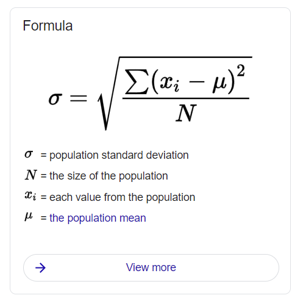

# 1A Fysikk som målefag

## Enheter

| størrelse | symbol | måletall | enhet        | konversjon                                              |   eksempel    |
| --------- | ------ | -------- | ------------ | ------------------------------------------------------- | :-----------: |
| Lengde    | s      | 3.0      | meter, m     |                                                         |  `s = 3.0m`   |
| tid       | t      | 7.0      | sekund, s    |                                                         |  `t = 7.0s`   |
| masse     | m      | 2.0      | kilogram, kg |                                                         |  `m = 2.0kg`  |
| fart      | v      | 3.2      | m/s          |                                                         | `v = 3.2m/s`  |
| fart      |        |          | km/t         | `90 km/t = 90 * 1000m / 3600s = 90 * 10m / 36s = 25m/s` | `v = 50 km/t` |

... side 18

## Formler

| formel  | navn             | eksempel                                   |
| ------- | ---------------- | ------------------------------------------ |
| `v=s/t` | gjennomsnittfart | `v = 2.0m/s, t = 4.0s, s=4.0s*2.0m/s = 8m` |

## Usikkerhet

`v = s/t = 3.02m / 7.1s = 0.42535m/s ~= 0.43m/s`

## Standardform

`c = 300 000 000 m/s = 3 * 10^8 m/s`

## Prefixer

| name  | prefix | value |
| ----- | ------ | ----- |
| terra | t      | 10^12 |
| giga  | G      | 10^9  |
| mega  | M      | 10^6  |
| kilo  | k      | 10^3  |
| micro | &mu;   | 10^-6 |
| nano  | n      | 10^-9 |

## Standerd avik

arr = [ 7.8, 7.0, 6.3, 7.1, 7.4 ]
mean = 7.1

standard_deviation ~= 1.2

# Oppgaver 1A

## 1.7

### a

`158 000s = 1.58s * 10^5 = 0.158 Ms = 158ks`

### b

`0.000 003 3m = 3.3m * 10^-6 = 3.3`&mu;`m`

### c

`5.34 mm / 75 ns = 5.34 (10^-3m) / 75s (10^-9) = (5.34 / 75)m/s _ 10^6 = 0.0712 Mm / s = 7.12 * 10^4 m/s`

## 1.1

### a

`0.12m / 0.1s = 1.20m/s ~= 1m/s`

### b

`0.050kg * 1.62m/s = 0.081kg m/s`

### c

`0.45m / (1.7s * 0.014m/s) = 0.45 / (1.7 * 0.014) = 18.90 ~= 18`

## 1.4

| t(s) | h(m) |
| ---- | ---- |
| 0.32 | 0.50 |
| 0.45 | 1.00 |
| 0.55 | 1.50 |
| 0.64 | 2.00 |

## 1.26

## 1.27

## 1.30

## puls

`53 / (41.35 - 1.8) = 1.34`
