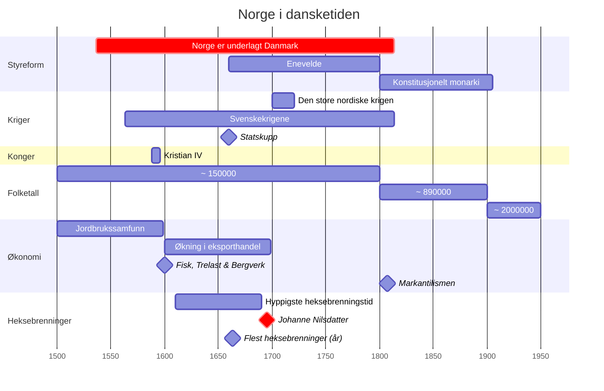

<!-- %%{init: { 'theme': 'default' } }%% -->

```mermaid
gantt
    dateFormat  YYYY
    axisFormat  %Y

    title       Norge i dansketiden


    section Styreform
    Norge er underlagt Danmark    : crit, 1536,1814
    Enevelde                      : 1660,1800
    Konstitusjonelt monarki       : 1800,1905
    %% section Om norge
    %% Oldenborgerstatet, Dannmark under norge

    section Kriger
    Den store nordiske krigen     : 1700,1721
    Svenskekrigene                : 1563,1814
    Statskupp                     : milestone, 1660,1660

    section Konger
    Kristian IV                   : 1588,1596


    section Folketall
    ~ 150000                      : 1500,1800
    ~ 890000                      : 1800,1900
    ~ 2000000                     : 1900,1950
    
    section Økonomi
    Jordbrukssamfunn              : 1500,1599
    Økning i eksporthandel        : 1600,1699
    Fisk, Trelast & Bergverk      : milestone, 1600,1600
    Markantilismen                : milestone, 1807,1807
    
    section Heksebrenninger
    Hyppigste heksebrenningstid   : 1610, 1690
    Johanne Nilsdatter            : crit, milestone, 1695,1695
    Flest heksebrenninger (år)    : milestone, 1663,1663
```
<!-- Da king lived    : 2000,2060 -->
<!-- Completed task   : 2014,2019 -->
