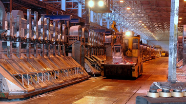

<!-- * >>> https://tffk.itslearning.com/ContentArea/ContentArea.aspx?LocationID=1679&LocationType=1 -->

# oppgave 1. Hva er global oppvarming

## drivhus effekten <!-- feedback -->

Drivhus effekten er en tilbakekoblingseffekt som inneberer det at klimaet på jorda blir varmere. Det som gjør dette til en tilbakekoblingseffekt er faktumet at jo varmere det er jo mer jorda har kapasitet til å varme opp som igjen leder til mer oppvarming.

## betydning

Effektene av global oppvarming er ganske dramatisk. Noe av det mest fundamentale som dette leder til er surere hav og mindre ferskvann skildre. Dette betyr at dyr i havet må tilpasse seg eller dø mens dyr som trenger ferskvann. Dette reduserer arts mangfoldet som betyr at noen arter dør ut og noen arter taper naturlige rovdyr som i sinn tur leder til en eksplosiv vekst av dem; noe som vil lede til katastrofale økosystem kollapser. Et økosystem kan være tenkt på som en betinget fornybar resurs fordi man kan utnytte den for mat, men hvis man tar for mye kan en art bli utryddet noe som leder til at du får mer av det du mest sannsynlig ikke trenger. I en situasjon der et helt økosystem kollapser som etter klimaendringer kan man ikke bruke den til noe lenger noe som betyr at resursen er brukt opp.

# oppgave 2. Grønnland V Oslo

## Grønnland

## Oslo kommune

Oslo kommune er kommunen som inneholder Oslo, hovedstaden i norge. Oslo er lokalisert i Fuktig kontinentalklima (Dfb) i følge _Köppen_ klima modellen. Dette innebærer milde sommere og årlig gjevnt distrubert nedbør &mdash; altså på snitt like mye nedbør om sommeren som i vinteren. Noe annet som kommer med denne klima klassifikasjonen er en stor variasjon i temperatur fra sommer til vinter fordi kategorien kaller for en måne kaldere enn -3&deg;c og 4 måner med mer enn 10&deg;c.

Oslo ligger i en fjord, Oslofjorden. Oslofjorden har Norges høyeste snitt temperatur for en fjord på 7.5&deg;c noe som betyr at klimaet i Oslo er påvirket av proximiteten til denne landformen.

Oslo er det mest befolkningsrike byen i Norge, derfor er det positivt at Oslo er ikke det mest påvirkede kommunen i Norge, men dette betyr ikke at de er ute av faresonen. Det er nemmeling en tempraturøkning på over 2.5&deg;c noe som leder til en stor reduksjon i arts mangfolded i og i nærheten av kommunen

# oppgave 3. Resurs kategorier

## Fornybare resurser

En fornybar resur er en resurs som man kan bruke uten eller med lite forbruks begrennslinger. Dette er grunnet at en fornybar resurs fornyer seg selv, noe som i praktis betyr at det kommer mer eller like mye av det enn det som blir brukt. Et eksempel av en fornybar resurs er noe så enkelt som vann. Vann går gjennom vannets kretsløp som så leder til at hvis vi for eksempel bruker vann for å kjøre turbiner i et brensel eller atomkraftferk så retunerer vanndampen som er produsert tilbake til vann som så kan brukes igjen i samme syklus.

## Betinget fornybar resurser

En betinget fornybar resurs er en resurs som er fornybar men bare hvis en betingelse er møtt. Dette vil si at vi for eksempel kan utnytte en resurs men ikke for mye fordi da kommer resursen til å vli oppbrukt. Et eksempel på en betinget fornybar resurs er skog. Vi kan hogge ned trær og som oftest vekser de tilbake, men hvis vi hugger ned alle trærne så er det ingen trær igjen til å reprodusere noe som leder til at skogen dør ut. Da er resursen brukt opp og kan ikke brukes lenger.

## Ikke fornybar resurser

En ikke fornybar resurs er en resurs som enten ikke fornyer seg i det hele tatt eller mer ofte brukt om en resurs som fornyer seg i et veldig stort tidsrom. Noen eksempler på ikke fornybare resurser er olje, kull, naturgass eller andre hydrokarbon produkter. Dette er fordi de er alle produsert av biomasser under høyt trykk, tempratur og store tidsrom. Det er nøyaktig disse faktorene som definerer resursene som ikke-fornybare fordi det skjer serdeles skjeldent i naturen og tidsromet er omkring 335&pm;45 mil år. Siden dette er et tidsrom lengere enn 1 000 000 ganger lengere enn homo-sapiens har eksistert er dette registrert som ikke-fornybar (dette er ikke en generell metric men en opplysning om kull).

# oppgave 4 bilder sinn sammenheng

## tabel

### 

*Our Common future* aka *Bruntlands rapporten* er en bok publisert i FN. Den er ekstremt viktig innenfor 

### 

### 

### 

### 

### 

### 

### 

### 

### 

### 

###  |

<!--
| image                                                                                    |
| :--------------------------------------------------------------------------------------- |
|                                            |
|                                                 |
|                    |
|  |
|                                    |
|               |
|                                                    |
|                                |
|                                           |
|                                                      |
|                                         |
|                                               |
-->

# skilder

- https://en.wikipedia.org/wiki/Oslofjord
- https://www.ipcc.ch/site/assets/uploads/2018/02/WG1AR5_Chapter12_FINAL.pdf @p33
- https://climate.nasa.gov/news/2940/greenlands-rapid-melt-will-mean-more-flooding/
- https://www.businessinsider.com/paris-climate-change-limits-100-years-2017-6?r=US&IR=T
- https://www.tropicaltidbits.com/
- https://www.nrk.no/klima/kommune/0301
- https://en.wikipedia.org/wiki/Greenland#/media/File:Topographic_map_of_Greenland_bedrock.jpg
- https://no.wikipedia.org/wiki/Norges_klima#/media/Fil:Norway_K%C3%B6ppen.svg
- https://en.wikipedia.org/wiki/Oslo#Climate
- https://energyeducation.ca/encyclopedia/Coal_formation
- https://en.wikipedia.org/wiki/Coal
- https://www.universetoday.com/38125/how-long-have-humans-been-on-earth
- https://en.wikipedia.org/wiki/Human
- https://en.wikipedia.org/wiki/Our_Common_Future