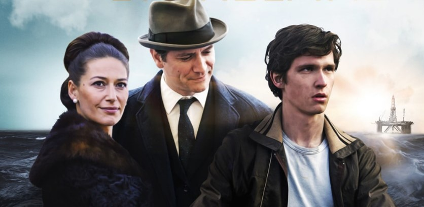

<!-- * >>> https://tffk.itslearning.com/ContentArea/ContentArea.aspx?LocationID=1679&LocationType=1 -->

# oppgave 1. Hva er global oppvarming

## drivhus effekten <!-- feedback -->

Drivhus effekten er en tilbakekoblingseffekt som innebærer det at klimaet på jorda blir varmere. Det som gjør dette til en tilbakekoblingseffekt er faktumet at jo varmere det er jo mer jorda har kapasitet til å varme opp som igjen leder til mer oppvarming.

## betydning

Effektene av global oppvarming er ganske dramatisk. Noe av det mest fundamentale som dette leder til er surere hav og mindre ferskvann skildre. Dette betyr at dyr i havet må tilpasse seg eller dø mens dyr som trenger ferskvann. Dette reduserer arts mangfoldet som betyr at noen arter dør ut og noen arter taper naturlige rovdyr som i sinn tur leder til en eksplosiv vekst av dem; noe som vil lede til katastrofale økosystem kollapser. Et økosystem kan være tenkt på som en betinget fornybar resurs fordi man kan utnytte den for mat, men hvis man tar for mye kan en art bli utryddet noe som leder til at du får mer av det du mest sannsynlig ikke trenger. I en situasjon der et helt økosystem kollapser som etter klimaendringer kan man ikke bruke den til noe lenger noe som betyr at resursen er brukt opp.

# oppgave 2. Grønnland V Oslo

## Grønnland

Grønnland er et en øy som er en utvidelse av Danmark. Hovedstaden er Nuuk. Fastlandet er cirka 5.6 ganger større en norge men har bare en hundrededel av befolkningen. Det vil si det er svært store landområder med særdeles få folk. Det kan være flere grunner for dette men noen av de to store er hva bakken er lagd av og hvordan kliamet er.

Klimaet i Grønland er fastsatt i to Köppen klasser. ET og EF. EF eller _Ice cap climate_ er som navnet sier is langt. Definisjonen av EF kategorien er at gjennomsnitts månlig tematur er ikke høyere enn 0&deg;c. Det vil si at på en års basis er det bare minusgrader. ET er enda mer interessant. Den innebærer at det er et miljø som tilfredsstiller permafrost. I dette tilfelle er områdene kategorisert som ET mest sannsynlig under Grønlands isen. Dette er en stor isbre som står oppå Grønland.

Grønlands isen står i fare. Hvis global oppvarming fortsetter på den trenden den, gjør nå kommer hele til å smelte. Dette er et **veldig** stort problem. Dette er et problem fordi den har et totalt volum av 3 420 000 km3. Hvis den smelter kommer havnivåene til å øke drastisk. Dette er et enda større problem siden global økning i temperatur er høyere jo mer når man kommer.

## Oslo kommune

Oslo kommune er kommunen som inneholder Oslo, hovedstaden i Norge. Oslo er lokalisert i Fuktig kontinentalklima (Dfb) i følge _Köppen_ klima modellen. Dette innebærer milde summere og årlig gjevt distribuert nedbør &mdash; altså på snitt like mye nedbør om sommeren som i vinteren. Noe annet som kommer med denne klima klassifikasjonen er en stor variasjon i temperatur fra sommer til vinter fordi kategorien kaller for en måne kaldere enn -3&deg;c og 4 måner med mer enn 10&deg;c.

Oslo ligger i en fjord, Oslofjorden. Oslofjorden har Norges høyeste snitt temperatur for en fjord på 7.5&deg;c noe som betyr at klimaet i Oslo er påvirket av proximiteten til denne landformenn.

Oslo er det mest befolkningsrike byen i Norge, derfor er det positivt at Oslo er ikke det mest påvirkede kommunen i Norge, men dette betyr ikke at de er ute av faresonen. Det er nemmeling en temperaturøkning på over 2.5&deg;c noe som leder til en stor reduksjon i arts mangfoldet i og i nærheten av kommunen

# oppgave 3. Resurs kategorier

## Fornybare resurser

En fornybar resurs er en resurs som man kan bruke uten eller med lite forbruks begrensinger. Dette er grunnet at en fornybar resurs fornyer seg selv, noe som i praktis betyr at det kommer mer eller like mye av det enn det som blir brukt. Et eksempel av en fornybar resurs er noe så enkelt som vann. Vann går gjennom vannets kretsløp som så leder til at hvis vi for eksempel bruker vann for å kjøre turbiner i et brensel eller atomkraftverk så returnerer vanndampen som er produsert tilbake til vann som så kan brukes igjen i samme syklus.

## Betinget fornybare resurser

En betinget fornybar resurs er en resurs som er fornybar, men bare hvis en betingelse er møtt. Dette vil si at vi for eksempel kan utnytte en resurs, men ikke for mye fordi da kommer resursen til å vil oppbrukt. Et eksempel på en betinget fornybar resurs er skog. Vi kan hogge ned trær og som oftest vesker de tilbake, men hvis vi hugger ned alle trærne så er det ingen trær igjen til å reprodusere noe som leder til at skogen dør ut. Da er resursen brukt opp og kan ikke brukes lenger.

## Ikke fornybar resurser

En ikke fornybar resurs er en resurs som enten ikke fornyer seg i det hele tatt eller mer ofte brukt om en resurs som fornyer seg i et veldig stort tidsrom. Noen eksempler på ikke fornybare ressurser er olje, kull, naturgass eller andre hydrokarbon produkter. Dette er fordi de er alle produsert av biomasser under høyt trykk, temperatur og store tidsrom. Det er nøyaktig disse faktorene som definerer resursene som ikke-fornybare fordi det skjer særdeles sjeldent i naturen og tidsrommet er omkring 335&pm;45 mil år. Siden dette er et tidsrom lengere enn 1 000 000 ganger lengere enn homo-sapiens har eksistert er dette registrert som ikke-fornybar (dette er ikke en generell metric men en opplysning om kull).

# oppgave 4 bilder sinn sammenheng

## tabel

### 

_Our Common future_ aka _Bruntlands rapporten_ er en bok publisert i FN. Den er en ekstremt viktig bok innenfor klima siden den grunnla den mordere definisjonen av utrykket _bærekraftig utvikling_. Dette var da definert som 'Utvikling som imøtekommer dagens behov uten å ødelegge mulighetene for at kommende generasjoner skal få dekket sine behov.' (hentet: [FNs verdenskommisjon for miljø og utviklings rapport Vår felles framtid (1987)](https://www.fn.no/tema/fattigdom/baerekraftig-utvikling))

### 

Dette er et bilde av den første oljeprøven fra Ekofisk. Ekofisk var det første og mest unike oljefeltet på Norsk sokkel så dette er et bilde av noe av den første oljen som noen gang ble dratt op på norsk sokkel. Altså dette er starten på Norge som olje nasjon.

<!-- _Log cabin Syrup_ er en type lønnesirup eller pannakake-sirup variert på hvilken variant man kjøper. For denne analysen skal vi fokusere på lønnesirup varianten. Lønnesirup er produsert av å destillere høye mengder med Xylem selje fra lønnetrær, i disse kalkulasjonene bruker vi rød-, svart- og sukkerlønne trær. Hver sesong produserer disse trærne sirka 40&pm;20 liter med selje hver sesong. Dette virker som mye til du lar merke til at det tar omlag 45 liter med selje for å produsere en litter med lønnesirup. Dette vil si at lønnesirup ikke er serlig bærekraftig å produsere &mdash; fordi konsentrasjonen er så høy og yieldet til trærne så lav i forhold til yielden av produktet. -->

### 

Dette er et bilde av et magasinkraftverk. Dette er en type hydroelektrisk kraftverk som har en stor vannkilde over seg. Magasinkraftverk er veldig gunstige siden de kan justere strøm output ettersom energikravene varierer. Det vil si at for eksempel om dagen der mange er på jobb og trenger strøm til å kjøre maskiner og pc-er har kraftverket evne til å sende ut nok energi i forhold til hva som trenges. Vannkraft er en helt ren energi kilde men som vil si den ikke slipper ut noe CO2 eller andre klimagasser under energi produksjon. Dette er noe som er veldig viktig basert på våres trend mot global oppvarming ved klimagasser.

### 

Dette bildet viser hvordan olje fårekommer i naturen der det er en kilde bergrart, en reservior bergart og en tak bergart. Olje kommer fra kildebergarten der biomasser har vært under høyt trykk over lang tid og så strømmer inn i resirvoret. Hær blir Oljen largret i en porøs bergart som har en tak-bergart over seg som er som oftest shifer. Den forhindrer oljen fra å gå opp til overflaten.

Når oljen er dannet er den klar for extraksjon. Dette er gjort gjennom brønner ned til resirvoir bergarten etter som trykket dytter opp oljen for så å bli lagret på rig eller ship før det blir refinert. Dette er ikke særlig bærekraftig siden hydrokarboner brennes til CO2 eller værre, metan. Disse er begge klimagasser som leder til global oppvarming.

### 

Dette er et bilde fra Hydro Aluminium Årdal, et Aluminiumverk driftet av Hydro Aluminium AS. Dette er en fram tenkende produksjons metode etter som vannkraft er mye grønnere enn alternativene.

### 

Dette er et kart over mulige lokasjoner av elvekraftverk over Norge. Alle lokasjoner for magasinkraftverk er dekket, derfor er det kun elvekraftverk igjen. Dette vil da si at Norge ikke utnytter elevepotensialet sitt fult.

### 

Dette er et bilde fra en av klima streikene som har skjedd nylig. Klimastreikene er et arrangement startet av Greta tunberg. Det er designet for å demonstrere mot verdensledere som motivasjon for at de skal gjøre noe mot det.

### 

Disse pengene kan komme fra mange mulige kilder. Den mest sannsynlige av dem er at de er oljepenger. Dette er fordi ettersom bilde ser ut som det inneholder store mengder med penger og olje er en veldig verdifull resurs.

### 

Dette er et kart over hvor norsk maritim grense. Den maritime grensen er til hvor Norge har definert at de eier det område. I dette tilfellet er det viktig fordi der Norge deklarerte suverenitet var det lokalisert store mengder med olje i ettertid.

### 

Dette er et bilde fra serien _Lykkeland_ som hadde et løp på NRK. Den baserer seg under Ekofisk funnet og hva som kommer av det. Det er en drama som inneholder både skrekkene av tidlig oljeutvinning og det gigantiske vunnet i kontekst med det norske olje funnet. Den utrykker hvor verdifullt det var for Norge, hvordan det hjalp Norge til en så stor grad som det gjør og også de som ofret seg selv for å dytte Norge fremover.

### 

Dette bildet er en kreativ redaksjon av fagbegrepet som heter Økologisk fot avtrykk. Utrykket baserer seg på hva vi etterlater bak oss miljømessig. Økologisk fotavtrykk kan utrykkes på mange måter. En av de nyttigste er å undersøke klimagass utslipp og resurs forbruk. Når det kommer til klimagass utslipp kan vi se på hvilken energikilde som blir brukt, for eksempel fotavtrykket for et kullkraftvert er mye større enn fotavtrykket til et vannkraftverk. Dette kaskader nedover til de som utnytter energi kilden også. Den andre faktoren av resurs forbruk kan ofte måles i mengden jordkloder av materiale som trenges for at hele verden skal leve på den måten. Hær gjør Norge det verre, men ikke i nærheten av verst, for at hele verden skulle kunne leve som oss i Norge hadde vi trengt 3.6jordkloder.

### 

Dette er et kart over norske oljefelt. Det kan vise hvor utbrett norsk oljeutvinning egentlig har blitt.

## Sammenhenger

<!--
| image                                                                                    |
| :--------------------------------------------------------------------------------------- |
|                                            |
|                                                 |
|                    |
|  |
|                                    |
|               |
|                                                    |
|                                |
|                                           |
|                                                      |
|                                         |
|                                               |
-->

# kilder

- https://en.wikipedia.org/wiki/Oslofjord
- https://www.ipcc.ch/site/assets/uploads/2018/02/WG1AR5_Chapter12_FINAL.pdf @p33
- https://climate.nasa.gov/news/2940/greenlands-rapid-melt-will-mean-more-flooding/
- https://www.businessinsider.com/paris-climate-change-limits-100-years-2017-6?r=US&IR=T
- https://www.tropicaltidbits.com/
- https://www.nrk.no/klima/kommune/0301
- https://en.wikipedia.org/wiki/Greenland#/media/File:Topographic_map_of_Greenland_bedrock.jpg
- https://no.wikipedia.org/wiki/Norges_klima#/media/Fil:Norway_K%C3%B6ppen.svg
- https://en.wikipedia.org/wiki/Oslo#Climate
- https://energyeducation.ca/encyclopedia/Coal_formation
- https://en.wikipedia.org/wiki/Coal
- https://www.universetoday.com/38125/how-long-have-humans-been-on-earth
- https://en.wikipedia.org/wiki/Human
- https://en.wikipedia.org/wiki/Our_Common_Future
- https://www.fn.no/tema/fattigdom/baerekraftig-utvikling
- https://www.plowingmatch.org/images/2014/pdfs/maplesyrup.pdf
- https://en.wikipedia.org/wiki/Maple_syrup
- https://no.wikipedia.org/wiki/Hydro_Aluminium_%C3%85rdal
- https://www.fn.no/Land/norge
- https://en.wikipedia.org/wiki/Greenland
- https://www.weatherbase.com/gr/koppen.png
- https://nordregio.org/wp-content/uploads/2018/03/Municipalities_in_Greenland_2009.jpg
